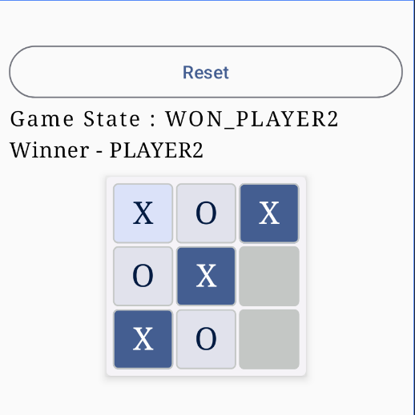
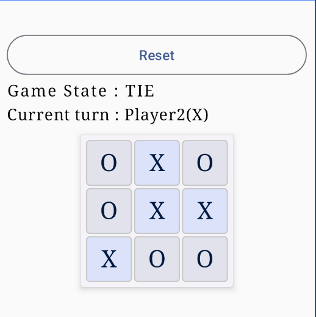
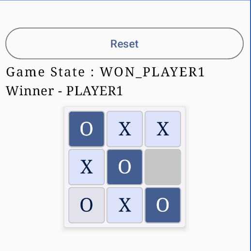

# TicTacToe Game using Jetpack Compose

This is a simple implementation of the classic TicTacToe game using Jetpack Compose, built for Android.

## Screenshots

<div align="center">
  
  
  
</div>

## Features

- **Interactive UI**: Utilizes Jetpack Compose for building a modern and interactive user interface.
- **Two Player Mode**: Play against another person on the same device.
- **Win Detection**: Automatically detects winning conditions and highlights winning moves.
- **Reset Game**: Option to reset the game and start over.
- **Scalable Design**: The UI is designed to scale properly on different screen sizes.

## Requirements

- Android device running API level 24 (Android 7.0 Nougat) or higher.

## Installation

Clone the repository:

```bash
git clone https://github.com/CoderBDK/TicTacToe.git
```
## License

This project is licensed under the MIT License. See the [LICENSE](LICENSE) file for details.
